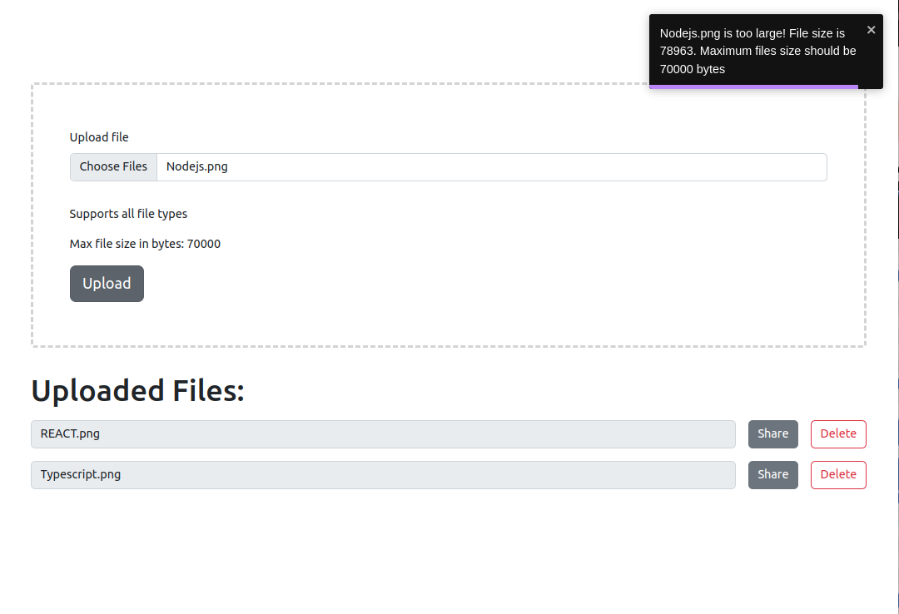

# FileShare

Fileshare is a REACT application with a flask server for backend services to help store and share files. The application consists of two parent folders `client` for the user interface and a `server` for backend functions/requests.

## Run application locally

### `Clone repo`

Clone the repo to your machine. Using your favourite terminal, run the command below.

`git glone https://github.com/fodare/FileShare.git`

### `Install dependdencies`

The application consists of a frontend app (REACT JS) and a backend server (Flask server), both requiring certain packages. To install dependencies, please run the commands below.

#### Frontend dependencies

`cd /client`

`npm install`

#### Backend dependencies

`cd /server`

#### Create and activate python virtual env

##### Linux

`sudo apt-get install python3-venv    # If needed`

`python3 -m venv .venv`

`source .venv/bin/activate`

##### Windows

`py -3 -m venv .venv`

`.venv\scripts\activate`

##### macOS

`python3 -m venv .venv`

`source .venv/bin/activate`

### `Start Client app`

Start the client-side application by executing the command below:

`cd /client/`

`npm start`

Start the server-side application by executing the command below:

`cd /server/`

`python3 server.py`

You can interact with the frontend application via the URL: <http://localhost:3000>. Backend proxy settings can be found in the client side `package.json` file, key `proxy`.

## Sample view

